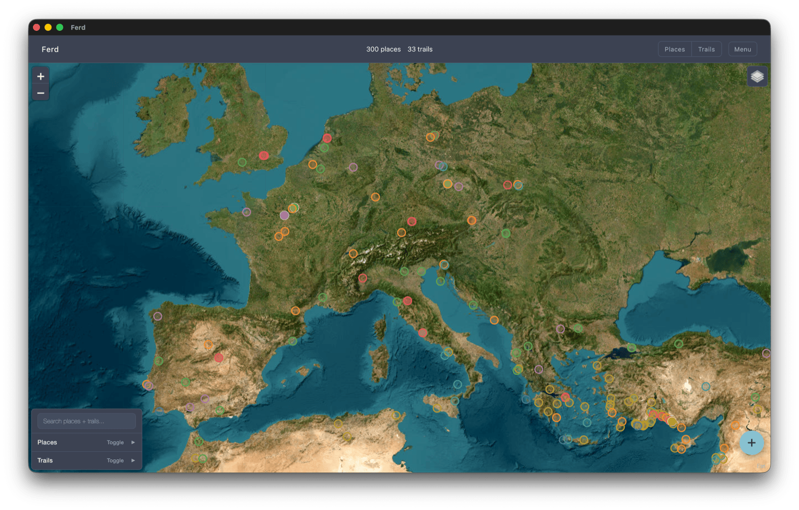

# Ferd

Your own map of where you've been, where you want to go, and the journeys between them.



*Ferd is Norwegian for "journey".*

## Features

**Map and data**
- World map with clustered place pins and GPX trail polylines.
- Filter by category, visit status, and trail completion.
- Browse places by category or country, trails by region.
- Trail detail with elevation profile and route stats.

**Editing and multi-user**
- Edit places and trails in the browser; optional GPX PII strip on upload.
- Per-user data isolation. Each account is its own map.
- Optional read-only public sharing at `/u/<username>/`.
- Per-user zip import/export.
- Admin tools: user management, site stats, registration and publishing toggles, audit log.

**Customization**
- Multiple themes, light and dark.
- Run places-only, trails-only, or both per deployment.
- Settings sync across devices for the same user (theme, mode, pin and trail styling).

**Phone and offline**
- Installable as a standalone app on your phone (PWA). See [docs/pwa.md](docs/pwa.md).
- Reads work offline: app shell, vendored map library, last loaded data, and previously viewed tiles are cached locally.
- Edits and uploads require network.

## Install

```sh
git clone https://github.com/polybjorn/ferd.git
cd ferd
cp tools/config.example.json tools/config.json
python3 tools/api.py
```

Open http://localhost:8091 and register the first account; that user becomes the admin.

**Requirements:** Python 3.9+, a modern browser. No build step, no Node, no database server (SQLite file).

Prefer Docker? See [docker.md](docs/docker.md). For service install, reverse proxy, and pre-seeded credentials, see [python.md](docs/python.md). For a public domain, front either with any reverse proxy. Sample configs in `deploy/`.

## Documentation

| Guide | Covers |
| --- | --- |
| [API reference](docs/api.md) | Every `/api/*` endpoint, for scripting. |
| [Architecture](docs/architecture.md) | How the code is organized and where data lives. |
| [Configuration](docs/configure.md) | Settings and feature flags you can tweak. |
| [Docker](docs/docker.md) | Run it in a container. |
| [PWA](docs/pwa.md) | Install on phone, offline behavior, maintenance. |
| [Python](docs/python.md) | Run it as a plain Python process (LAN, systemd, launchd). |
| [Themes](docs/themes.md) | Look and feel options, and how to add your own. |

## Roadmap

- Prebuilt multi-arch container image so deployments can `docker compose pull`.
- Print / PDF stylesheet for trail and place details.
- Auth hardening: optional TOTP 2FA.
- Photo attachments on places and trails.
- Custom iOS launch splash: add pre-rendered `apple-touch-startup-image` PNG files (one `<link>` per device size + orientation) in `index.html`. Without these iOS shows a generic splash with the auto-rendered icon.
- Bundle leaflet-elevation's runtime deps (d3, togeojson, geometryutil, almostover) so the elevation chart works offline.
  - When this lands, total vendored deps goes from 5 to 9. Worth adding a small GitHub Action + check script at that point to flag upstream version bumps via issues; below 9 deps it isn't worth the ceremony.
- Automate the service worker `CACHE_VERSION` bump on release (currently a manual line edit in `sw.js`).

## License

GPL-3.0-or-later. See [LICENSE](LICENSE); third-party deps in [vendor/NOTICES.md](vendor/NOTICES.md).
