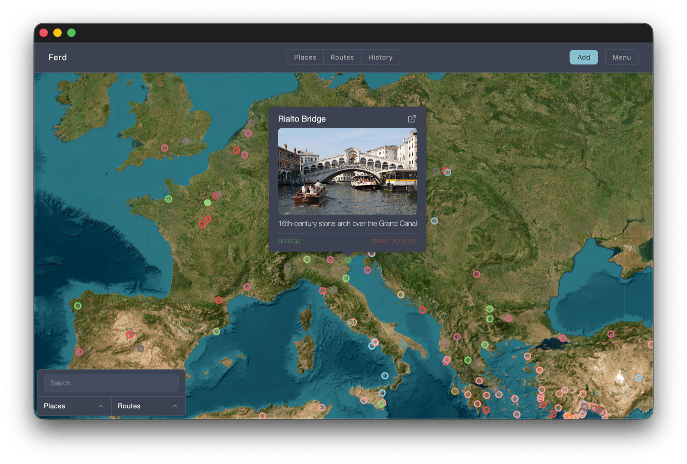

# Ferd

Your own map of where you've been, where you want to go, and the journeys between them. Self-hosted or fully on-device, with no tracking.



*Ferd is Norwegian for "journey".*

## Features

**See where you've been and where you're going**
- World map with clustered place pins and GPX route polylines.
- Route detail with elevation profile and route stats.
- History page that journals your visited places and completed routes.
- Browse and import community-curated places from the site catalog, or extend it with your own.
- Powerful filtering and browsing by category, country, visit status, region, and route completion.

**Share on your terms**
- Per-user data isolation - each account is its own map.
- Optionally publish your map as a read-only public page anyone can view by link.
- Admin tools for user management, site stats, and registration and publishing toggles.

**Use it anywhere**
- Install to your device and launch it in its own window.
- Reads work offline (app shell, last loaded data, downloaded GPX, previously viewed tiles). Edits and uploads need network.
- Local-only mode that runs entirely on-device with no server or account.

## Install

**Requirements:** Python 3.9+ (or Docker), a modern browser. No build step, no Node, no database server (SQLite file).

**Footprint:** ~1.7 MB of code and assets. Python uses about 32 MB of memory at idle; the Docker image is ~45 MB compressed (211 MB on disk) and runs at roughly the same memory plus a small container overhead.

Full documentation in [docs/](docs/).

### Python

```sh
git clone https://github.com/polybjorn/ferd.git
cd ferd
cp tools/config.example.json tools/config.json
python3 tools/api.py
```

Open http://localhost:8091 and register the first account. See [python.md](docs/python.md) for systemd/launchd setup, first-run hardening, and backups.

### Docker

Quickstart against [`compose.yml`](compose.yml):

```sh
git clone https://github.com/polybjorn/ferd.git
cd ferd
mkdir -p data
cp site-config.example.json data/site-config.json
cp .env.example .env
docker compose up -d
```

Open http://localhost:8090 and register the first account. See [docker.md](docs/docker.md) for tag tracks, FERD_* env vars, and data folder permissions.

### Android

Android client, server-connected or fully on-device. Use an APK manager to auto-update, or download the [latest release](https://github.com/polybjorn/ferd/releases/latest) APK directly.

[](https://apps.obtainium.imranr.dev/redirect?r=obtainium://add/https://github.com/polybjorn/ferd)

## Roadmap

### Content
- Print and PDF stylesheet for route and place details.
- Uploaded image attachments on places and routes.

### Offline
- Offline editing, queued and synced when the connection returns (reads already work offline).

### Branding
- Distinctive logo.
- Custom iOS launch splash (PWA).
- Custom Android launcher icon.
- Custom social preview image for the GitHub repository.
