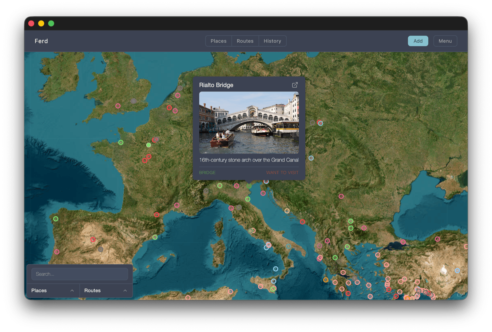

# Ferd

Your own map of where you've been, where you want to go, and the journeys between them. Self-hosted or fully on-device, with no tracking.



*Ferd is Norwegian for "journey".*

Ferd shows a world map with clustered place pins and GPX route polylines. Route detail has an elevation profile and route stats, and a history page journals your visited places and completed routes. You can browse and import community-curated places from the site catalog or extend it with your own, and filter and browse by category, country, visit status, region, and route completion.

Each account is its own map, with per-user data isolation. You can optionally publish your map as a read-only public page anyone can view by link. Admin tools cover user management, site stats, and registration and publishing toggles.

Ferd installs to your device and launches in its own window. It works offline: reads (app shell, last loaded data, downloaded GPX, previously viewed tiles) and edits, which queue on-device and sync when the connection returns. Account and admin actions still need network. A local-only mode runs entirely on-device with no server or account.

## Install

**Requirements:** Python 3.9+ (or Docker), a modern browser. No build step, no Node, no database server (SQLite file).

### Python

```sh
git clone https://github.com/polybjorn/ferd.git
cd ferd
cp tools/config.example.json tools/config.json
python3 tools/api.py
```

Open http://localhost:8091 and register the first account. See [python.md](docs/python.md) for systemd/launchd setup, first-run hardening, and backups.

### Docker

Quickstart against [`compose.yml`](compose.yml):

```sh
git clone https://github.com/polybjorn/ferd.git
cd ferd
mkdir -p data
cp site-config.example.json data/site-config.json
cp .env.example .env
docker compose up -d
```

Open http://localhost:8090 and register the first account. See [docker.md](docs/docker.md) for tag tracks, FERD_* env vars, and data folder permissions.

### Android

Android client, server-connected or fully on-device. Use an APK manager to auto-update, or download the [latest release](https://github.com/polybjorn/ferd/releases/latest) APK directly.

[](https://apps.obtainium.imranr.dev/redirect?r=obtainium://add/https://github.com/polybjorn/ferd)

## Docs

Full documentation is in [docs/](docs/). Planned work is in [docs/roadmap.md](docs/roadmap.md).

## License

GPL-3.0, see [LICENSE](LICENSE).
